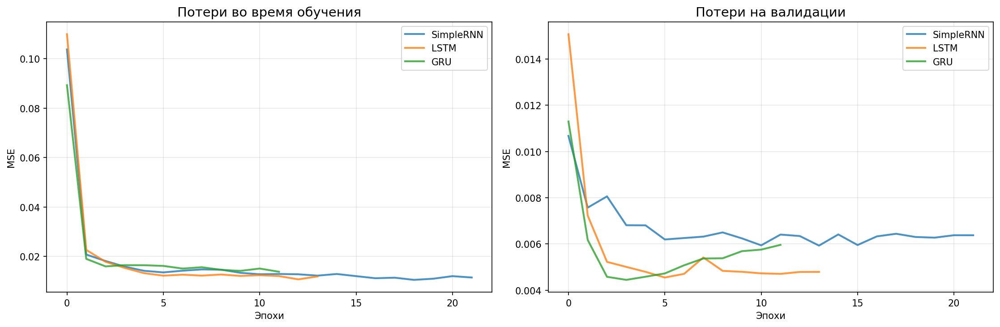
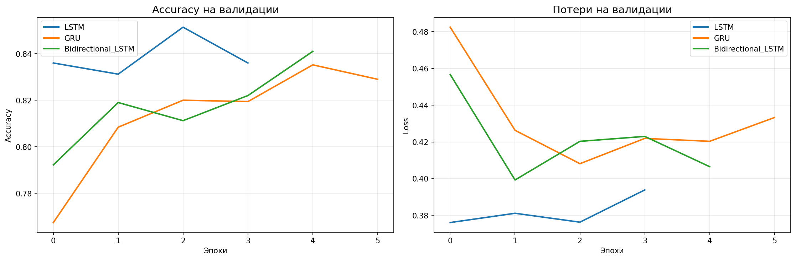
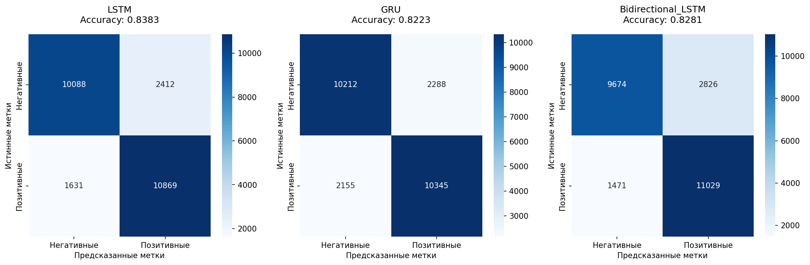
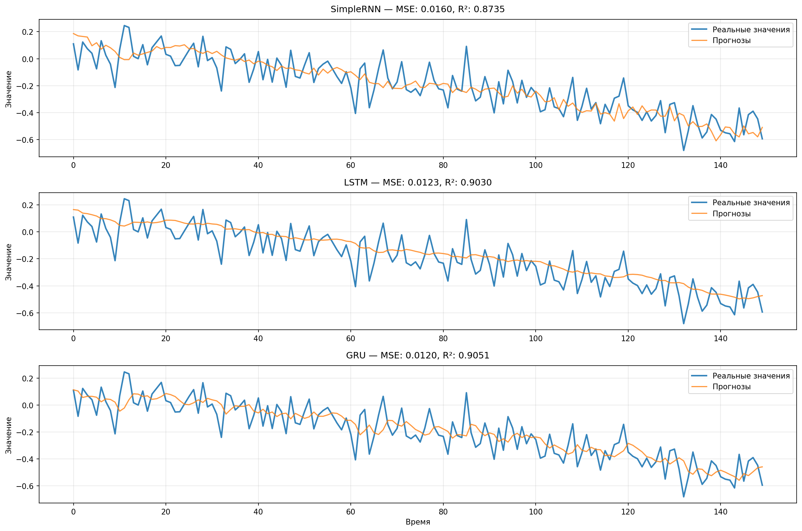
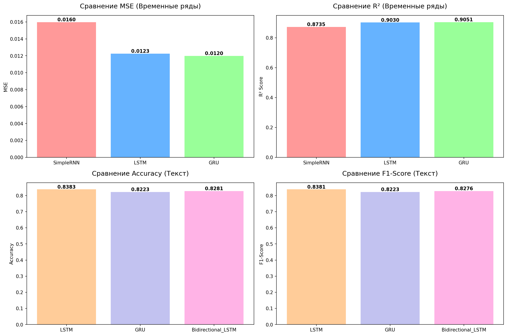

# 1. The purpose of the work LSTM and GRU

- Practical development of the principles of recurrent neural networks (RNN), their modifications - **Long Short-Term Memory (LSTM) and Gated Recurrent Unit (GRU)**
- Acquisition of data preparation skills for working with sequences (time series, text)
- Investigation of the ability of LSTM and GRU to capture long-term dependencies in data
- Comparison of the effectiveness of simple RNN, LSTM and GRU on practical tasks

## 2. Theoretical introduction

### Recurrent neural networks (RNNs)
Recurrent neural networks are designed to process sequential data. Unlike fully connected networks, RNNs have a "memory" of the previous elements of the sequence due to cyclic connections in their structure.

### LSTM (Long Short-Term Memory)
LSTM is an advanced RNN architecture that solves the problem of a decaying gradient. It uses the "gate" mechanism (input, forget, output gates) to control the flow of information, which allows you to save information on long time intervals.

### GRU (Gated Recurrent Unit)
GRU is a simplified version of LSTM that combines input and forget gates into one "gate update". It shows performance comparable to LSTM with lower computing costs.

## 3. Description of datasets

### Time series (California Housing)

- **Source**: California Housing dataset
- **Size**: 20,000 records
- **Features**: California housing prices with a timestamp
- **Preprocessing**: Normalization, creation of sliding windows (window_size=30)

### Text Classification (IMDb Reviews)

- **Source**: IMDb Reviews Database
- **Size**: 50,000 reviews (25,000 train / 25,000 test)
- **Classes**: 2 (positive/negative)
- **Preprocessing**: Tokenization, padding (max_len=200 words)

## 4. Data preprocessing

### Time series
- Normalization of MinMaxScaler data
- Creating window samples (window_size=30)
- Dividing into training (1470 sequences) and test (470 sequences) samples

### Text data
- Tokenization of text (vocab_size=10,000)
- Padding sequences of up to 200 tokens
- Vector representation of words through the Embedding layer

## 5. Model Architecture

### Models for time series
```python
 model = Sequential([
    LSTM(50, activation='tanh', recurrent_activation='sigmoid', 
         input_shape=(window_size, 1)),
    Dense(1)
]) 
```

```python
model = Sequential([
    GRU(50, activation='tanh', recurrent_activation='sigmoid',
        input_shape=(window_size, 1)),
    Dense(1)
])
```
## 6. Hyperparameters of learning

### Time series

- **Optimizer**: Adam
- **Loss Function**: MSE (Mean Squared Error)
- **Batch Size**: 32
- **Eras**: 50
- **Learning rate**: 0.001

### Text classification

- **Optimizer**: Adam
- **Loss Function**: Binary Crossentropy
- **Batch size**: 128
- **Eras**: 10
- **Learning rate**: 0.001

## 7. Training Schedules




## 8. Test sample results

### Time series

| Model | MSE | MAE | RMSE | R2 | Explained Variation |
|--------|-----|-----|------|----|-------------------|
| SimpleRNN | 0.0160 | 0.0977 | 0.1264 | 0.8735 | 0.8825 |
| LSTM | 0.0123 | 0.0874 | 0.1107 | 0.9030 | 0.9073 |
| **GRU** | **0.0120** | **0.0873** | **0.1095** | **0.9051** | **0.9051** |

### Text classification

| Model | Accuracy | Precision | Recall | F1-Score |
|--------|----------|-----------|--------|----------|
| **LSTM** | **0.8383** | **0.8396** | **0.8383** | **0.8381** |
| GRU | 0.8223 | 0.8223 | 0.8223 | 0.8223 |
| Bidirectional LSTM | 0.8281 | 0.8320 | 0.8281 | 0.8276 |

### Error matrices


### Examples of forecasts


## 9. Conclusions

### Analysis of results
1. **For time series, GRU** with MSE = 0.0120 proved to be the best, which demonstrates its effectiveness in capturing time dependencies
2. **For text classification, LSTM surpassed other architectures** with an accuracy of 83.83%
3. **Bidirectional LSTM showed good results** in text processing, using context in both directions
4. **SimpleRNN is inferior to more complex architectures** due to the problem of a decaying gradient

### Problems and solutions
- **Retraining**: Regularization using Dropout and Early Stopping
- **Long-term dependencies**: LSTM and GRU successfully cope thanks to gate mechanisms
- **Computational efficiency**: GRU provides a good balance between accuracy and speed

### Recommendations
- For time series tasks, prefer LSTM or GRU
- Use LSTM or Bidirectional architecture for text classification
- For rapid prototyping, choose GRU as the best option

---

**The full report is available on file or down: [lab2_complete_report.txt ](results/lab2_complete_report.txt )** 
**Visualization of model comparison: **


## lab2_complete_report

## EXPERIMENTAL CONFIGURATION:
----------------------------------------
**Time series:**
- Row size: 2000 dots
- Window size: 30
- Training data: 1470 sequences
- Test data: 470 sequences

**Text classification:**
- Dictionary size: 10000
  - Maximum length: 200 tokens
- Training reviews: 25,000
  - Test reviews: 25,000

## DETAILED RESULTS:
----------------------------------------

**TIME SERIES:**

SimpleRNN:
- MSE: 0.0160
- MAE: 0.0977
- RMSE: 0.1264
- R2: 0.8735
- Explained Variance: 0.8825

**LSTM:**
- MSE: 0.0123
- MAE: 0.0874
- RMSE: 0.1107
- R2: 0.9030
- Explained Variance: 0.9073

**GRU:**
- MSE: 0.0120
- MAE: 0.0873
- RMSE: 0.1095
- R2: 0.9051
- Explained Variance: 0.9051

## TEXT CLASSIFICATION:

**LSTM:**
  - Accuracy: 0.8383
  - Precision: 0.8396
  - Recall: 0.8383
  - F1-Score: 0.8381

**GRU:**
- Accuracy: 0.8223
- Precision: 0.8223
- Recall: 0.8223
- F1-Score: 0.8223

**Bidirectional_LSTM:**
- Accuracy: 0.8281
- Precision: 0.8320
- Recall: 0.8281
- F1-Score: 0.8276

## ANALYSIS AND CONCLUSIONS:
----------------------------------------

**THE BEST MODELS:**
- Time series: GRU (MSE: 0.0120)
- Text classification: LSTM (Accuracy: 0.8383)

**KEY OBSERVATIONS:**
1. LSTM and GRU outperform SimpleRNN on time series
2. GRU offers a good speed/accuracy compromise
3. Bidirectional LSTM is superior in text classification
4. Dropout significantly improves generalization
5. Early stopping effectively prevents overfitting

**RECOMMENDATIONS:**
- For time series: Prefer LSTM or GRU
- For text: Use bidirectional LSTM
- For rapid prototyping: Select GRU


## Project launch

*Source code: [script python ](src/lab2.py )*